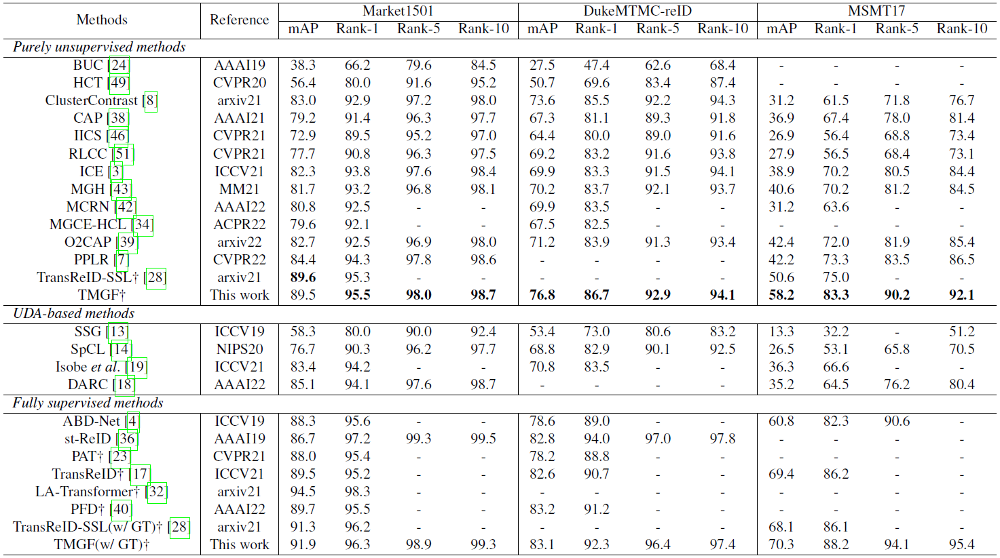

# Transformer-Based Multi-Grained Features for Unsupervised Person Re-Identification (TMGF)

<!-- The code will be available soon. -->

[](https://paperswithcode.com/sota/unsupervised-person-re-identification-on-12?p=transformer-based-multi-grained-features-for) \
[](https://paperswithcode.com/sota/unsupervised-person-re-identification-on-5?p=transformer-based-multi-grained-features-for) \
[](https://paperswithcode.com/sota/unsupervised-person-re-identification-on-4?p=transformer-based-multi-grained-features-for)

Official implementation of paper [Transformer-Based Multi-Grained Features for Unsupervised Person Re-Identification](https://openaccess.thecvf.com/content/WACV2023W/RWS/html/Li_Transformer_Based_Multi-Grained_Features_for_Unsupervised_Person_Re-Identification_WACVW_2023_paper.html) (WACV2023 workshop).

In this work, a dual-branch network based upon ViT is build to generate different granularities of part features from local tokens, learning together with global features for better discriminating capacity. Extensive experiments on three person Re-ID datasets are conducted and show that the proposed method achieves the state-of-the-art performance in unsupervised methods.


## Prerequisites

### Pretrained Weight

TMGF is fine-tuned on the pretrained weight, which can be found from [TransReID-SSL](https://github.com/damo-cv/TransReID-SSL). In our model, we use `ViT-S/16+ICS`. Download [here](https://drive.google.com/file/d/18FL9JaJNlo15-UksalcJRXX-0dgo4Mz4/view?usp=sharing).

### Installation

Clone this repo and extract the files.

We recommand `conda` to create a virtual Python 3.7 environment and install all requirements in it. Extra packages are listed in `requirements.txt` and can be installed by `pip`:

```bash
conda create -n torch1.6 python=3.7
conda activate torch1.6

pip install -r requirements.txt
```

### Training

Download the datasets and put them into the right place.
Check and run the shell script `train.sh`:

```bash
CUDA_VISIBLE_DEVICES=0 ./train.sh # run on GPU 0
```

We use `yacs` config system for better parameter management. You may need to modify the dataset root directory `DATASET.ROOT_DIR` and the pretrained weight path `MODEL.PRETRAIN_PATH`. Check [here](https://github.com/rbgirshick/yacs) to learn how to change configs as you like.

> 2023/8/18: We fix a typo of `nn.DataParallel` misusage in [prepare_model.py](https://github.com/RikoLi/WACV23-workshop-TMGF/blob/main/libs/utils/prepare_model.py), which may cause some bugs in forwarding.


### Evaluation

You can run evaluation on any datasets with model weight provided.

```bash
CUDA_VISIBLE_DEVICES=0 python evaluate.py --weight /path/to/model/weight.pth --conf configs/TMGF_full.yml # run on GPU 0
```

## Performance



## Acknowledgement

We would like to sincerely thank [TransReID](https://github.com/damo-cv/TransReID), [TransReID-SSL](https://github.com/damo-cv/TransReID-SSL) and [O2CAP](https://github.com/Terminator8758/O2CAP) for their insightful ideas and outstanding works!

## Citation

If you feel our work helpful in your research, please cite it like this:

```bibtex
@InProceedings{Li_2023_WACV,
    author    = {Li, Jiachen and Wang, Menglin and Gong, Xiaojin},
    title     = {Transformer Based Multi-Grained Features for Unsupervised Person Re-Identification},
    booktitle = {Proceedings of the IEEE/CVF Winter Conference on Applications of Computer Vision (WACV) Workshops},
    month     = {January},
    year      = {2023},
    pages     = {42-50}
}
```
